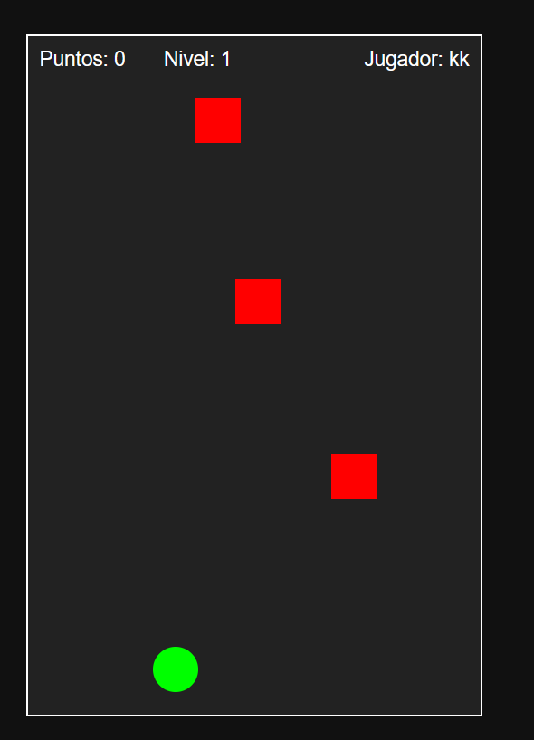

🎮 Squares Shooter
Squares Shooter es un mini videojuego arcade hecho en HTML, CSS y JavaScript puro. El jugador controla un círculo verde que dispara hacia arriba para destruir enemigos cuadrados rojos que caen desde la parte superior. ¡Evita colisiones, acumula puntos y alcanza tu récord personal!

🧩 Características

- 🧑‍💻 Pantalla de inicio con nombre personalizado
- 🎯 Movimiento con teclado y mouse
- 💥 Disparo con barra espaciadora o flecha arriba
- 🟥 Enemigos que caen y aumentan su velocidad con el puntaje
- 🧠 Sistema de niveles automáticos
- 🏆 Puntaje y récord personal guardado en localStorage
- 🎬 Pantalla de créditos al perder, con botón de reinicio
- 📱 Diseño responsive para pantallas pequeñas
- ✨ Animaciones suaves y efectos visuales

🚀 Cómo jugar

- Abre index.html en tu navegador.
- Ingresa tu nombre y haz clic en Aceptar.
- Usa las flechas izquierda/derecha o mueve el mouse para controlar al jugador.
- Presiona espacio o flecha arriba para disparar.
- Evita que los enemigos te toquen. Si lo hacen, ¡pierdes!
- Al perder, verás tu puntaje y podrás reiniciar.

📁 Estructura del proyecto
squares-shooter/
├── index.html # Estructura principal del juego
├── style.css # Estilos y animaciones
└── script.js # Lógica del juego

🛠️ Tecnologías usadas

- HTML5
- CSS3 (con media queries y animaciones)
- JavaScript (DOM, eventos, localStorage)

💡 Ideas para futuras mejoras

- 🎵 Sonidos de disparo, explosión y derrota
- ❤️ Sistema de vidas o escudos
- 🔫 Power-ups (disparo doble, velocidad, etc.)
- 👾 Enemigos con patrones de movimiento

¡Diviértete jugando y programando! 🚀

# shotSquarers

